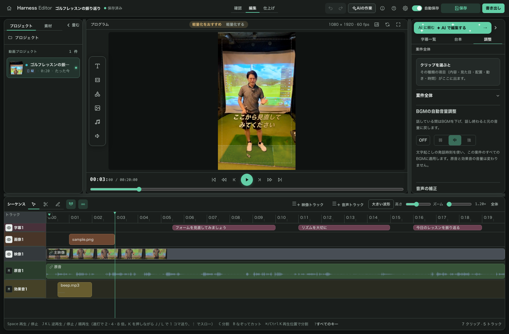

# Harness Editor

**AI が9割作った動画の、最後の1割を人が直すための無料エディタ。**

カット・テロップ・効果音・BGM・画像・書き出しを、ブラウザの1画面で操作します。
Mac 対応、MIT ライセンス、**完全ローカル動作**（素材も音声も外部に送りません）。Windows 版は 0.7.0 で未検証です。

エンジニア向けのツールではありません。ゴルフのレッスンプロ（非エンジニア）が、
自分の動画編集が終わらないので作りました。



> 作者の実測値: 33分18秒の素材が9分19秒になりました（カット率 72%）。
> 短くなる量は素材によります。この数字は作者の動画1本の実測で、平均でも保証値でもありません。

**はじめての方へ**: 0.7 の実画面を見ながら一通り体験できる
**[はじめてガイド](docs/はじめてガイド.md)** を用意しています。取り込み→カット→テロップ→書き出しまで最短で1本仕上がります。

---

## 主要機能

| | できること |
|---|---|
| カット | 波形とタイムラインを見ながら範囲選択・分割・削除。**非破壊**（元動画は変えず、残す区間だけを持つ） |
| テロップ | 文字起こしの行を画面で直す。位置・大きさはプレビュー上でドラッグ。スタイル3種をクリックで切替。切り替える**前**に適用範囲（このテロップ / 全テロップ）を選べます（既定は「このテロップ」・全テロップにしても Cmd/Ctrl+Z で戻せます） |
| 効果音 / BGM | 手持ちのファイルをタイムラインへ配置。BGM はフェードイン/アウト付き |
| 画像 / サブ動画 | 挿入画像・サブ動画（Bロール）を区間指定で差し込む |
| 音声処理 | **ノイズ除去**・**音量正規化**（どちらもローカルで完結・クレジット消費なし） |
| カラーグレーディング | 明るさ・コントラスト・彩度・色温度、暗部・中間調・明部のカラーホイール、`.cube` 形式の LUT に対応 |
| 速度 | 全体一律／区間ごと（0.1〜16倍） |
| つなぎ | トランジション7種（フェード・クロスフェード・スライド・ワイプ 等） |
| 文字起こし | ローカル Whisper（Mac: mlx-whisper / Windows・Linux: openai-whisper）。API キー不要 |
| 作品の作成 | 動画のほか、音声ファイル1件や画像1〜200枚から作品を作れます。画像は選んだ順に並びます |
| 書き出し | エディター内蔵の描画で MP4 を出力（0.7 から Remotion を使いません）。書き出し用ブラウザは `setup` が入れます。解像度3種 × 画質3種。透かしは入りません |
| AI 連携 | 画面右上の **「AIで編集する」** から Claude Code / Codex CLI を呼ぶ（下記） |
| ファイル管理 | 素材もプロジェクトも**ゴミ箱経由**で削除（使用中なら警告・あとから復元できます）。外付けなどに同じ動画があれば**リンクで繋いで容量を回収** |
| 進行管理 | 一覧 ⇄ **進行ボード**の切替。文字起こし → カット → テロップ → SE・BGM → 書き出し済の工程列にカードを D&D して進捗を管理 |
| ヘルプ | 画面右上の **「？」** から、機能ごとの説明を写真つきで開けます |
| チュートリアル | はじめて開いたときに、作品づくりを一通り案内します。「？」からいつでも見直せます |
| 学習 | 書き出し後の **「AIとの差分レビュー」** で、AI の案から自分が直した箇所を選んで記録できます（0.3.1 までの案件を取り込んだ物が対象） |

編集内容は**テキストのデータとして保存されます**。0.7 の編集内容は `.harness/project.v2.json` に保存されます。
AI はエディターの編集用ツールを通して変更し、人も同じ画面で確認・修正します。旧形式の `.ts` ファイルを直接書き換えても、取り込み済みの新しい編集内容には反映されません。

### 他ツールと比べてどこが違うか

- **無料・AI 連携あり・完全ローカル** の3つを同時に満たすツールは、2026年8月時点で調べた範囲では他に見当たりませんでした（無料の対抗は AI 機能が有料版限定か、クラウド送信が前提でした）。
- **ノイズ除去と音量正規化が、無料でローカルで動きます。** 追加の課金もアップロードも要りません（他ツールでは有料版の機能になっていることがあります）。
- **クレジット制限がありません。** 文字起こしも音声処理も自分のパソコンで動くので、使った分だけ減る枠のようなものはありません。

> **※ AI 連携を使う場合の注意**: 画面から AI に編集を頼む機能を使うには、**別途 Claude Code
>（Anthropic のサブスク）もしくは Codex（ChatGPT のサブスク）の契約が必要**です。
> 契約がなくても、カット・テロップ・書き出しなどエディタ本体の編集機能はすべて無料で使えます。

---

## クイックスタート

エンジニア向けの手順は要りません。**ダウンロードして、ダブルクリックするだけ**です。

### Mac

Apple Silicon Mac 向けのアプリも配布します。アプリを使う場合は配布された `.app` を開いてください。署名・公証前の候補では、macOS の確認画面が出たときに右クリックから「開く」を選びます。ソースから使う場合は次の手順です。

1. このリポジトリを ZIP でダウンロードして解凍する（または `git clone`）。
2. Finder で解凍したフォルダを開く。
3. `setup.command` をダブルクリック（初回のみ・数分かかる）。
   - 「開発元が確認できません」と出たら、右クリック → 開く で実行する。
4. `start.command` をダブルクリック。ブラウザが自動で開く。
5. 終了は、起動時に開いたターミナル窓を閉じる（または窓内で Ctrl+C）。

### Windows

0.7.0 の Windows 版は未検証です。以下は従来のブラウザ版の起動手順です。

1. このリポジトリを ZIP でダウンロードして解凍する（または `git clone`）。
2. エクスプローラーで解凍したフォルダを開く。
3. `setup.bat` をダブルクリック（初回のみ・数分かかる）。
   - 「Windows によって PC が保護されました」（SmartScreen）と出たら「詳細情報」→「実行」。
4. `start.bat` をダブルクリック。ブラウザが自動で開く。
5. 終了は、起動時に開いた黒いウィンドウを閉じる（または窓内で Ctrl+C）。

動画の取り込みに使う ffmpeg は、`setup` スクリプトが**自動で導入します**（Mac: Homebrew または
検証済みビルドの取得 / Windows: winget）。手動での準備は不要です。
自動導入に失敗した場合のみ、既にある `ffmpeg.exe` のフルパスを環境変数 `HARNESS_FFMPEG` に
設定してください（`start.bat` 内にコメントで設定例あり。同じフォルダの `ffprobe.exe` も使われます）。

---

## AIで編集する（Claude Code / Codex）

画面右上の **「AIで編集する」** から AI 用のターミナルを開けます。動画を見ながら自然文で編集を頼めます。

- **Claude Code が入っていなければ、ボタンひとつでこのエディタ専用に導入します**（`sudo` 不要・システムを汚しません）。
- エディタとの接続も自動で設定されます。別のターミナルを開いて設定コマンドを打つ必要はありません。
- Codex CLI（ChatGPT サブスク）も選べます。両方入っている場合だけ切替ボタンが出ます。

AI の料金は、使用するサービスの契約と認証方法に従います。手動編集・プレビュー・書き出しには AI の契約は必要ありません。

手順の詳細は **[AI接続マニュアル](docs/AI接続マニュアル.md)** を参照してください。

---

## 難しいことは AI にお任せしましょう

このエディタは「AI が作った動画の仕上げを人が直す」ための道具なので、次の機能は**画面には入っていません**
（今後も、この方針に合わないものは画面には足さない予定です）。
プロジェクトの実体はテキストのデータなので、ここに無い編集が必要になったら、
まず **「AIで編集する」から AI に相談してみてください**。現在の編集用ツールで実現できる範囲を確認できます。

| 機能 | 状況 |
|---|---|
| クロマキー（グリーンバック合成） | **対象外**。撮影側で担保する想定 |
| 内蔵の BGM・効果音ライブラリ | **対象外**。素材は持ち込み前提（ライセンスの責任を負わないため） |
| 縦横比の変更（横動画 → ショート） | **未対応**。縦横比はプロジェクト作成時の動画で決まります |
| モーショングラフィックス・3D・トラッキング | **対象外** |

---

## 動作環境

- **OS**: macOS（Apple Silicon の Mac アプリとブラウザ版を検証）。Windows / Linux は 0.7.0 で未検証
- **必要なもの**: ブラウザ版は Node.js（20.19 以上）・ffmpeg・書き出し用ブラウザ（Chrome for Testing）。`setup` が確認し、ffmpeg と書き出し用ブラウザは自動導入します（Node.js は導入を案内します）
- **文字起こしを使う場合**: Python 3.10 以上 ＋ `pip install mlx-whisper`（Mac）または `pip install openai-whisper`（Windows / Linux）。アプリから起動した場合も、Homebrew・Python公式インストーラー・uv/pipxの標準的な導入先を探します。独自の場所に導入した場合は `SUPERMOVIE_PYTHON` または `.supermovie-python` でPythonのパスを指定できます。
- **ブラウザ**: Chrome / Edge / Safari の最新版
- **ネットワーク**: 編集・書き出しはオフラインで動きます（AI を使うときは通信します）

> **⚠️ セキュリティ上の注意**: 本エディタは、開いたプロジェクトのデータファイルと部品（`.ts` / `.tsx`）を
> 読み込んで評価し、エディター内で組み立てて描画・書き出しに使います（プロジェクトのコードが実行されます）。
> **自分で作成した、または信頼できる提供元の
> プロジェクトだけ**をプロジェクトフォルダに置いてください。
>
> ローカルサーバ（`localhost:2109`）は認証を持たないローカル専用です。ローカル以外の Host/Origin からの
> アクセスは拒否しますが、信頼できない共有マシンでの起動は避けてください。

---

## 0.7.1 からの変更点（0.7.2）

- **AI・外部編集をすばやく反映** — 編集用ツールによる変更をプレビューとタイムラインへ通知します。保存済みの編集データが外部で変わったときは、未保存の編集や入力・ドラッグがなければ自動で読み込みます。未保存の内容がある場合は保持し、読み込みを案内します。外部の保存内容を読み込むとUndo履歴は新しくなります。
- **案件をスムーズに切り替え** — 入力を確定して保存に成功してから、ページ全体を読み直さずに移動します。案件ごとの表示位置と再生位置を保持し、ブラウザーの「戻る」にも対応します。
- **読込エラーからホームへ復帰** — 文字起こしがないなどの理由で編集データを開けなくても、ホームへ戻れます。読込済みの案件で保存に失敗した場合は、入力を保ったまま移動を中止します。

## 0.7.0 からの変更点（0.7.1）

- **AI ターミナルへファイルをドラッグ&ドロップできるようになりました。** 画像や動画を右パネルのターミナルへ落とすと、そのファイルの場所が入力されます（Claude Code では画像が添付されます）。送信はされないので、続けて指示を書き足してください。ブラウザ版では、落としたファイルを一時フォルダへコピーしてから渡し、エディターの終了時に片付けます。
- **プレビューが止まった時の表示を詳しくしました。** 「映像の読み込み／復号／復号の完了待ち がタイムアウトしました（元の動画／軽量版）」のように、止まった段階と読んでいたファイルを表示します。不具合を報告いただく際にこの表示を添えていただくと、原因を絞り込めます。

## 0.3.1 からの変更点（0.7.0）

今回の目玉は、**独自プレビューと新編集画面／カラーグレーディング／音声・写真からの作品作成／書き出し後の学習レビュー**です。[画像付きのアップデート情報](https://video-harness.app/updates/)でも紹介しています。

- **編集画面を作り直しました。** 書き出しはエディター内蔵の描画になり、Remotion を使わなくなりました。0.3.1 までの案件は、開くと新しい形式へ取り込まれます（元のファイルは変えません）。
- **カラーグレーディングに対応しました。** 映像を選び、「調整」→「見た目」で色を調整できます。カラーホイールと LUT の読み込みも使えます。
- **音声や画像からも作品を作れます。** 音声1件は黒画面と音声の MP4、画像は選んだ順に各5秒で並ぶ MP4 にできます。
- **「？」ヘルプ・初回チュートリアル・書き出し後の学習レビュー**を新しい画面へ対応させました。学習候補が0件でもチェック結果を表示します。比較できるのは旧案件を取り込んだ作品で、比較元がなければ理由を表示します。
- **setup が書き出し用ブラウザも入れます。** Node.js は 20.19 以上が必要です。更新した方は `setup` をもう一度実行してください。
- **作品の保存先は変わりません**（`start.command` / `start.bat` から起動した場合は、エディターフォルダ内の `projects/`）。
- **なくなったもの**: `project-template` を単独の Remotion プロジェクトとして動かす手順と旧来の書き出し部品。
- **同梱のテロップスタイル**は 0.3.1 と同じ無料の3種です。
- [はじめてガイド](docs/はじめてガイド.md) と [AI接続マニュアル](docs/AI接続マニュアル.md) の画像・操作手順を、0.7 の実画面へ更新しました。
- **無料のテロップ3種**は調整パネルに最初から表示します。書き出し動画の保存名は **「ハーネス_作品名.mp4」** が候補になります。
- **Apple Silicon Mac アプリを含めます。** Windows のデスクトップ版は未検証です。

---

## 質問できる場所

使い方で詰まったら、オープンチャットで質問できます。

→ **[質問用オープンチャット](https://go.takicoach.com/jr8f5j)**

不具合の報告・要望は [GitHub の Issue](https://github.com/takicoach/harness-editor/issues) へお願いします。

---

## 設定（任意）

- `HARNESS_PROJECT_ROOT`: 動画プロジェクトが並ぶフォルダ。
  `start.command` / `start.bat` から起動した場合の既定は**エディタフォルダ内の `projects/`**（無ければ自動で作られます）。
  別の場所に置きたい場合は、この環境変数を指定するか起動スクリプトの該当行を書き換えてください。
  `npm start` を直接実行した場合の既定はカレントディレクトリです。
- `HARNESS_MAX_UPLOAD_BYTES`: 取り込み1件あたりのサイズ上限（既定 32 GiB）。
- ホーム画面のステータス表示（未着手／文字起こし／カット／テロップ／SE・BGM／書き出し済・AI 作業中）を
  自作スキルから制御したい場合は [status-file-spec](docs/status-file-spec.md) を参照。
- 本エディタは、Claude Code 用の動画編集スキルが生成する**互換形式のプロジェクト**もそのまま開けます。
  独自の編集スキルをお持ちの方向けに、**[スキル移行ガイド](https://guide.video-harness.app/)** を公開しています。

### 再 transcribe（カット焼き込み済みプロジェクト向け）

抽出済み・カット適用済みのプロジェクト（transcript が元動画全体で video が抽出版）では単語チップが
意味を成さないため自動で無効化されます。黄色バナーの「video から transcript を作り直す」ボタンで
現在の video に対して文字起こしをやり直せます。

プロジェクトルートに `transcribe_params.json` を置くとパラメータを上書きできます:

    {
      "language": "ja",
      "initial_prompt": "プログラミング解説の動画です。専門用語: TypeScript, React, ..."
    }

---

## 開発者向け

```bash
npm install
HARNESS_PROJECT_ROOT=/path/to/projects npm start   # http://localhost:2109
```

```bash
npm run typecheck   # 型チェック
npm test            # ユニット / サーバテスト
npm run test:e2e    # Playwright UI スモーク
```

`test:e2e` はフィクスチャプロジェクトで開発サーバを起動します。別の `vite`（`npm run edit` 等）が
起動済みだとそちらへ接続してしまうので、先に停止してください。2109 を実エディタが使用中で止められない
場合は隔離ポート(5199)で動く `npx playwright test --config playwright.isolated.config.ts` を使います。

---

## ライセンス

MIT License（[LICENSE](LICENSE) を参照）。

0.3.1 までの案件に残る旧形式の部品には Remotion 向けの原文が含まれることがあります。0.7.0 のプレビューと書き出しは Remotion を使用しません。

同梱している第三者コードの表記は [THIRD_PARTY_NOTICES.md](THIRD_PARTY_NOTICES.md) を参照してください。
