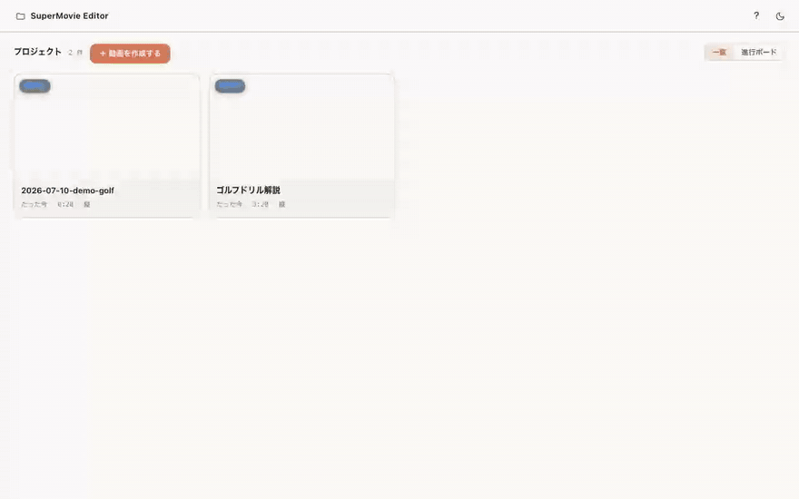
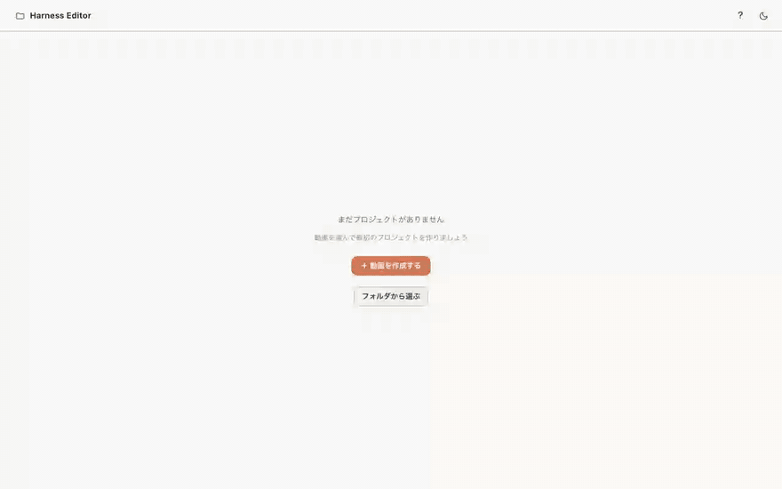
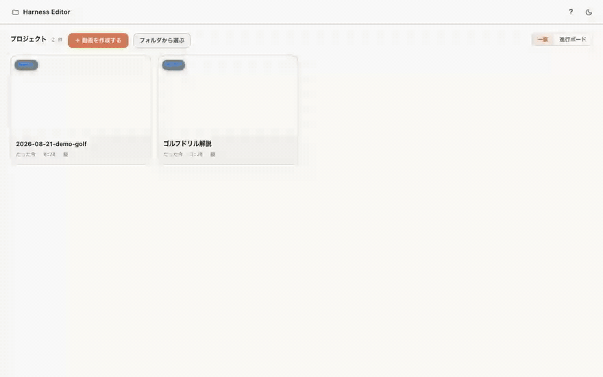
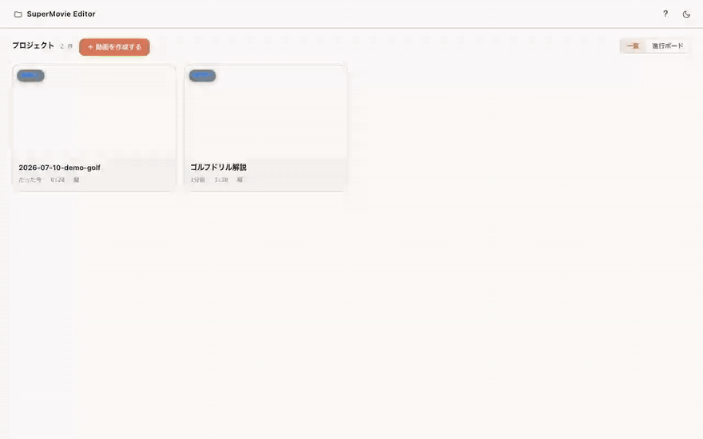
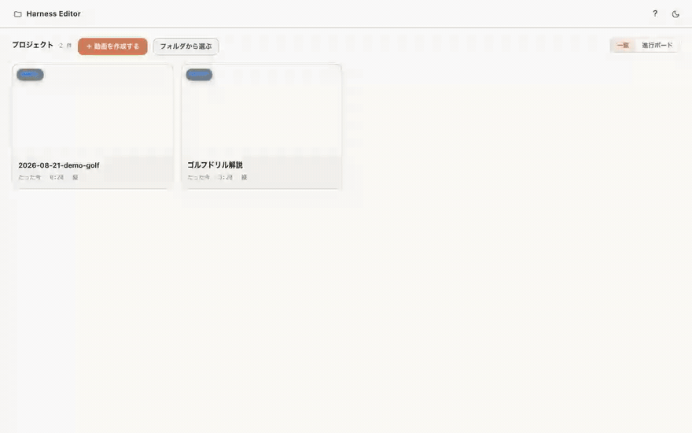

# はじめてガイド — GitHub から入手したその日に1本仕上げる

> **0.7 について**: 0.7 で編集画面が新しくなりました。このガイドの画面（GIF）は 0.3 のものです。新しい画面の使い方は、エディター右上の「？」と、はじめて開いたときのチュートリアルで確かめられます。

Harness Editor へようこそ。このガイドは、はじめての方が**インストール → 動画の取り込み → カット → テロップ → 効果音 → 書き出し**まで、実際の画面の動き（GIF）を見ながら一通り体験できるように作られています。


> はじめてエディタを開くと、画面上に **チュートリアル「はじめての1本」** が自動で始まります。まずはその案内に従うのが最短です。このガイドは、その後「あの操作どうやるんだっけ？」と見返すための操作集としても使えます。
>
> エディタが新しくなった箇所には、ホーム右上の **？（チュートリアル図鑑）** の項目一覧に **NEW** バッジが付きます。その項目を開くとバッジは消えるので、増えた機能だけを追いかけられます。

---

## 0. インストール（初回のみ・約5分）

ターミナルが苦手な方は **ダブルクリックだけ** でセットアップできます。
画像つきの詳しい手順は **[導入手順ページ](https://setup.video-harness.app/)** にまとめてあります。要点だけ書くと:

1. このリポジトリを ZIP でダウンロードして解凍（または `git clone`）
2. 解凍したフォルダの `setup.command`（Windows は `setup.bat`）をダブルクリック（初回のみ・数分）
3. `start.command`（Windows は `start.bat`）をダブルクリックで起動 → ブラウザが自動で開きます

開発者の方は次でも同じです:

```bash
npm install
HARNESS_PROJECT_ROOT=/path/to/projects npm start
```

> **独自の編集スキルをすでにお持ちの方へ**: Claude Code 用の自作動画編集スキルをこのエディタに
> つなぐ手順は、**[スキル移行ガイド](https://guide.video-harness.app/)** に
> まとめてあります（元のスキルは変更せず、コピーを作って移行する方式です）。

---

## 1. 動画を取り込む（新規プロジェクト）

ホーム画面の **「＋ 動画を作成する」** を押して動画ファイル（.mp4 / .mov など）を選ぶだけ。fps・長さ・縦横の判定と初期設定はすべて自動です。作成が終わるとそのまま編集画面が開きます。

動画ファイルをホーム画面へそのままドラッグ＆ドロップしても取り込めます（複数落とした場合は1件目だけが使われます）。


- プロジェクト名は「日付-ファイル名」が自動で入ります。そのまま Enter でも、書き換えてもOK
- 大きい動画は軽量プレビューを裏で自動生成するので、読み込みで固まりません

動画は、同じファイルが登録済みのフォルダ（外付け・デスクトップ・ダウンロード・ムービー）にあれば**コピーせずリンクで繋いで**取り込みます（内蔵ストレージを使いません）。必ずコピーしたい時は作成画面の「コピーして取り込む」にチェックを入れてください。外付けの動画を直接選ぶなら **「フォルダから選ぶ」** が使えます。

ホーム右上の表示切り替えで **「進行ボード」** にすると、**未着手 → 文字起こし → カット → テロップ → SE・BGM → 書き出し済** の6つの工程列に動画が並びます。列は自動で判定されますが、カードをドラッグして別の列へ動かすとその工程に固定でき（「手動」バッジが付きます）、ステータスバッジのメニュー「自動判定に戻す」で解除できます。各カードの下には工程の進み具合も表示されます。

---

## 2. カットする

タイムラインの**動画トラックをドラッグして範囲選択** → 「カット」ボタン。カットした区間はグレーのブロックになり、いつでも端をつまんで調整・解除できます（非破壊編集。元の動画は変更されません）。



- 再生ヘッドの位置でスパッと切りたい時は「ヘッドで分割」
- カット結果も含めて通しで確認したい時は「カットも再生」をオフに

---

## 3. テロップを直す・足す

右側の **じまく一覧** から行をクリックすると、その場で文字を書き換えられます。プレビューには即反映。



- 語句のタップでその部分だけ動画からカット（フィラー消しに便利）
- 「分割」「次と結合」で行の区切りを調整
- 「設定」タブでテロップのデザイン（スタイル）を変更

---

## 4. 効果音・BGM・画像を入れる

左カラムを **素材タブ** に切り替えると、プロジェクト内の効果音・BGM・画像・サブ動画が一覧できます。**「挿入」ボタンで再生ヘッドの位置へ**、または**タイムラインへ直接ドラッグ**で好きな位置へ。



- 素材はこのウィンドウに**ファイルをドロップするだけ**でも追加できます
- 効果音・BGM は行のボタンで試聴してから入れられます

### いらない素材・プロジェクトを消す（ゴミ箱）

- 素材: 「素材」タブでアイテムにマウスを乗せると出るゴミ箱アイコンを押す → 確認して「ゴミ箱へ移動」
- プロジェクト: ホームのカード右上に出るゴミ箱アイコン（一覧・進行ボードとも）、またはステータスバッジをクリック → 「ゴミ箱へ移動」
- 消したものは「ゴミ箱」ボタン（素材はライブラリ上部、プロジェクトはホーム右上）から復元・完全削除できます
- タイムラインで使用中の素材を消そうとすると、使用箇所数つきの警告が出ます（既定はキャンセル）

---

## 5. シーン転換をつける

タイムラインのいちばん上、時間の目盛りに重なる高さに **◇（ひし形）** が並んでいます。これがシーン転換です。**カットが1つも無くても、動画の先頭と末尾には最初から出ています**（カットするとその切れ目にも増えます）。

◇ をクリックすると右の設定パネルが **「シーン転換設定」** に変わり、フェード（暗転／白転／色指定）・クロスフェード・スライド・ワイプなどを選べます（先頭と末尾はフェードのみ）。設定した ◇ は**ピンク（コーラル）**に塗られるので、どこに付けたか一目で分かります。クリックして選んでいる間は**オレンジ**に変わり、少し大きくなります。

書き出しに反映させるには、設定パネルに出る **「シーン転換を導入（書き出しに反映）」** を一度押してください（導入済みならボタンは出ません）。

---

## 6. 保存する

ツールバーの保存ボタン（**⌘S** でも同じ）で保存されます。未保存なら「保存 (⌘S)」、済んでいれば「保存済み ✓」と表示が変わります。⚙ 設定の **「自動保存」** が既定で入っているので、編集の手が止まると自動でも保存されます。

---

## 7. 書き出す

右上の **「書き出し」** → プリセットを3つから選んで開始します。

- **投稿用（高画質）** — 動画の向きで名前が変わります（縦=ショート / Reels、横=YouTube、正方形=フィード）
- **標準（画質とサイズのバランス）**
- **軽量・確認用（720p・共有やX投稿に）**

「詳細設定」を開くと解像度と画質を個別に指定できます。開始すると未保存の編集は**自動で保存**され、進捗が表示されます。完成したら **「Finderで表示」** ですぐ確認できます。



---

## 8. 画面の設定（⚙）

ツールバーの ⚙ から、画面レイアウト（**標準 / 全高 / 字幕 / 波形**）、喋っている間だけ BGM を下げる **ダッキング**（弱・中・強）、波形の高さ、自動保存の ON/OFF、ライト⇄ダークの切り替えができます。**チュートリアル図鑑**を開き直すのもここです。

---

## 9. AI と一緒に編集する（任意）

編集画面右の **AI タブ**を開くと、AI（Claude Code / Codex）に日本語で編集を頼めます。「ここをカットして」「テロップを赤に」のような自然文で OK。接続は**すべて自動**で、コマンドを打つ設定作業はありません（Claude Code が未導入ならボタンひとつで入ります）。

AI が作業している間は、プロジェクト一覧に **「カット中」などの作業中表示** がリアルタイムで光ります。



つなぎ方は、編集画面の **「AI」タブを開くだけ**です。設定ファイルを書く必要はありません。

1. AI タブを開く → AI がタブの中で立ち上がります
2. まだ入っていないパソコンでは **「AI と接続する（Claude Code を導入）」** が出るので、押して導入 → ログイン
3. **「待機を開始（編集指示を受け付ける）」** を押すと、指示待ちの状態になります。この待機役はすべての動画を担当し、指示ごとに裏で助手（subagent）へ任せるので複数の動画を同時に進められます

複数の AI を入れている場合は、タブ上部で **「Claude」「Codex」** を切り替えられます。

- 使い方の詳細・Q&A・別ターミナル運用（上級者向け）: [AI接続マニュアル](AI接続マニュアル.md)
- 自作スキルからこの表示を制御する仕様: [status-file-spec](status-file-spec.md)

---

## 困ったときは

| 症状 | 対処 |
|---|---|
| 動画がぐるぐるして表示されない | 大容量・特殊コーデックの可能性。`ffmpeg` で軽量プレビュー（`main.preview.mp4`）を作ると自動で優先されます |
| 編集が反映されない | 上部に「外部変更」バナーが出ていたら「再読み込み」を押す |
| AI 連携がつながらない | まず「AI」タブを開き直す（「もう一度接続する」ボタン）。導入からやり直す場合は上の 9 章の手順。詳しくは [AI接続マニュアルの Q&A](AI接続マニュアル.md#4-つまずいた時の-qa) |

---

### このガイドの GIF について（開発者向け）

GIF は手動録画ではなく、`npm run docs:gifs` で**実 UI を自動操作しながら再収録**できます（`scripts/record-guide-gifs.mjs`）。UI を変更したら再実行すれば、全 GIF が新しい見た目に揃います。特定の GIF だけ作り直す場合は `npm run docs:gifs -- cut telop` のように指定してください。
