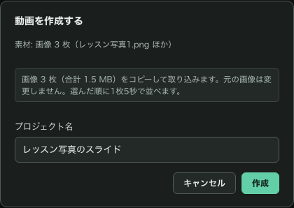
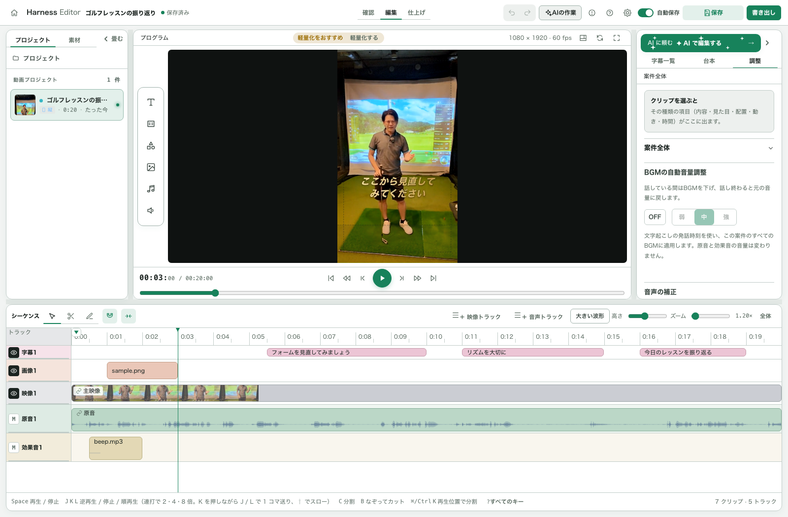
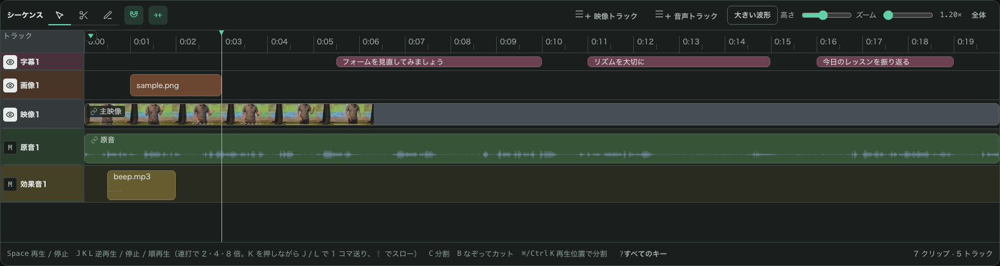
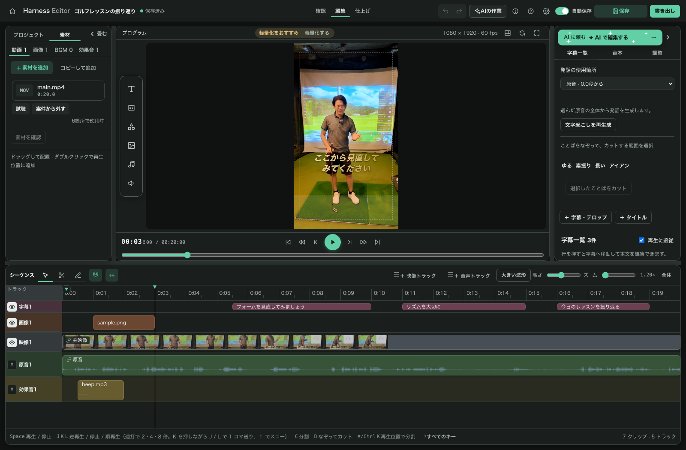
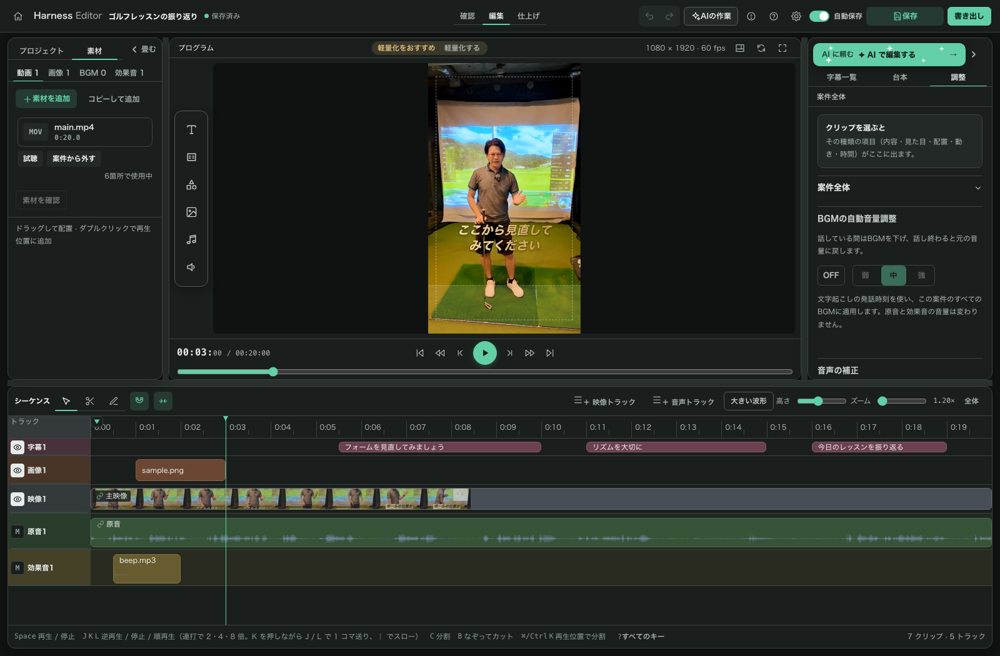
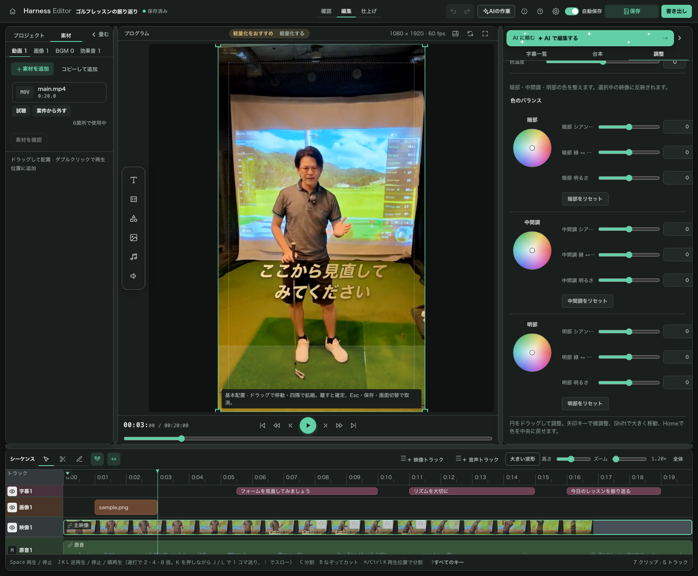
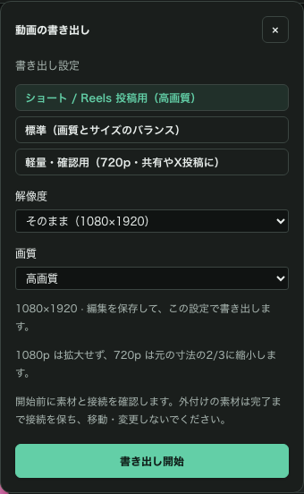
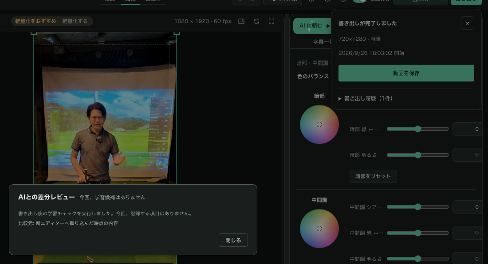

# はじめてガイド — 0.7 の画面で1本仕上げる

取り込み → カット → テロップ → 色の調整 → 書き出しまでを、**0.7.0 の実画面**で紹介します。画像は2026年9月26日に撮影しました。クリックすると拡大できます。

はじめて開くとチュートリアルが始まります。右上の **「？」** から機能ごとの説明を開いたり、チュートリアルを見直したりできます。

## 1. 起動する

ブラウザ版は GitHub からダウンロードして解凍し、初回に `setup.command`、続いて `start.command` を開きます。更新した方も `setup.command` をもう一度実行してください。Windows の `setup.bat` / `start.bat` は、0.7 では未検証です。

Apple Silicon Mac アプリを使う場合は、アプリを開きます。プロジェクトフォルダーはアプリの「保存先」メニューで選べます。

0.3.1 までの作品を開くと、新しい形式へ取り込む案内が出ます。**「編集を始める」** を押すと0.7の画面へ進みます。取り込み元のファイルは残ります。

## 2. 動画・音声・写真から作品を作る

ホームの **「＋ 動画を作成する」** から素材を選び、作品名を確認して **「作成」** を押します。素材をホームへドラッグ＆ドロップしても始められます。

- **動画**: 動画ファイル1件から作成します。
- **音声**: 音声ファイル1件から、黒背景と音声の作品を作ります。
- **画像**: 1〜200枚を、選んだ順に1枚5秒で並べます。画像はコピーして取り込まれます。

動画を外付けドライブから使う場合は、元ファイルを参照するかコピーするかを作成画面で確認してください。参照した素材を編集するときは、そのドライブを接続しておきます。

## 3. 画面を見渡す

上部の **「確認」「編集」「仕上げ」** で作業に合った表示へ切り替えられます。中央がプレビュー、下がタイムラインです。

- 左側: プロジェクトと素材の一覧。
- 右側: **「字幕一覧」「台本」「調整」**。クリップを選ぶと、その種類に合った調整項目が出ます。
- 境界線: ドラッグすると、プレビュー・右のパネル・タイムラインの広さを変えられます。

ライトテーマにも切り替えられます。

## 4. 不要な部分をカットする

タイムラインで **「なぞってカット」**（ショートカット **B**）を選び、映像上の不要な範囲をドラッグします。切れ目を作りたいときは **「分割」**（**C**）、再生位置での分割は **⌘/Ctrl＋K** が使えます。

元の動画は変更されません。間違えたら **⌘/Ctrl＋Z** で戻し、プレビューで前後のつながりを確かめてください。その他のキーはタイムライン下の **「すべてのキー」** で確認できます。

## 5. テロップを直す

右の **「字幕一覧」** で行を押すと、その位置へ移動して本文を編集できます。文字起こしがない作品では、AIに文字起こしを頼むか、プレビュー横の文字追加ボタンからテロップを足します。

テロップのクリップを選んで **「調整」** を開くと、本文・文字のスタイル・配置・動きを変更できます。無料の3種類はパネル内に表示されます。全字幕へスタイルを適用する場合は、対象の範囲を確認してから実行してください。

## 6. 素材を足す

左の **「素材」** タブに動画・画像・BGM・効果音が並びます。**「＋ 素材を追加」** やファイルのドロップで追加し、タイムラインへドラッグして配置します。素材をダブルクリックすると再生位置へ追加できます。

選んだ映像・画像・音声の設定は右の「調整」で変更します。素材を案件から外すときは、タイムラインで使われていないかを確認してください。

## 7. カラーグレーディングで色を整える

映像クリップを選び、**「調整」→「見た目」** を開きます。カラーの項目では、明るさ・コントラスト・彩度・色温度を変更できます。

**暗部・中間調・明部のカラーホイール**で色のバランスを細かく調整できます。`.cube` 形式の LUT を読み込むと、強度や適用前との比較も操作できます。「設定をコピー」と「貼り付け」で、ほかの映像へ色の設定を揃えられます。

## 8. 保存して、MP4 を書き出す

右上の **「保存」** で編集内容を保存します。**「自動保存」** を有効にすると、編集後に自動で保存されます。終了前に「保存済み」の表示を確認してください。

**「書き出し」** で解像度と画質を選び、**「書き出し開始」** を押します。

完了したら **「動画を保存」** を押します。保存名は **「ハーネス_作品名.mp4」** が候補になります。動画・音声・写真から作った作品はいずれも MP4 で書き出します。

## 9. 書き出し後の学習を確認する

完了後に **「AIとの差分レビュー」** が開きます。学習候補があれば内容を確認し、記録したい項目だけ選んで学習します。

候補が0件でもチェック結果を表示します。比較できるのは **0.3.1 までの案件を取り込んだ作品**です。新規作品など比較元がない場合は、その理由が表示されます。不要な候補を無理に学習する必要はありません。

## 10. AI に編集を頼む

右上の緑色の帯 **「AIで編集する」** を押すと、Claude Code / Codex の接続画面が開きます。導入していない場合は、画面に表示される案内から始めてください。

詳しい操作は **[AI接続マニュアル](AI接続マニュアル.md)** を参照してください。手動で編集するだけなら、AI の契約は不要です。

## 困ったときは

| 症状 | 確認すること |
|---|---|
| プレビューが重い | 画面に「軽量化する」が出たら、軽量プレビューを作成する |
| 素材が見つからない | 元の動画や外付けドライブを接続し、素材の参照先を確認する |
| AI の編集が反映されない | 「AIの作業」で結果・競合を確認する。取り込み済みの旧 `.ts` ファイルへの変更は新画面には反映されない |
| 学習候補がない | 0件も正常な結果。比較元がない場合は画面に理由が出る |
| 操作が分からない | 右上の「？」からヘルプとチュートリアルを開く |

不具合は [GitHub Issues](https://github.com/takicoach/harness-editor/issues) へ、使い方の相談は [オープンチャット](https://go.takicoach.com/jr8f5j) へどうぞ。
